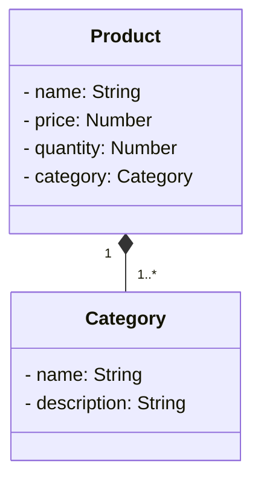

# API Simples de Produto e Categoria feita em Spring Boot
- JAVA RESTful API criada como projeto do bootcamp da DIO Santander

## Diagrama de classes

- API feita em 2 horas então ainda não há uma relação correta entre as tabelas (Categorias que se repetem ainda tem o ID distinto)